<!-- Banner -->

  

  Desenvolvedor Full Stack em formação, focado em aplicações web, backend, frontend, APIs e sistemas completos.

  
  
  
  

---

<h2 align="center">Sobre mim</h2>

  Sou estudante de Ciência da Computação e desenvolvedor Full Stack em formação, com interesse em criar sistemas reais, bem estruturados e conectados a necessidades práticas.

  Tenho foco em desenvolvimento web, APIs REST, backend, frontend, bancos de dados relacionais e integração entre sistemas. Atualmente venho desenvolvendo projetos com React, C#/.NET, Java, JavaScript, PostgreSQL e MySQL.

  Busco minha primeira oportunidade profissional na área de desenvolvimento, com interesse especial em backend, frontend, APIs, banco de dados e sistemas empresariais.

---

<h2 align="center">Atualmente estudando</h2>

  C#/.NET • React • APIs REST • PostgreSQL • Docker • GitHub Actions • Integração de sistemas • Boas práticas de backend

---

<h2 align="center">Projetos em destaque</h2>

<table>
  <tr>
    <td width="50%">
      <h3>NexoVest</h3>
      

        Sistema web de gestão integrada com funcionalidades para clientes, produtos, pedidos, usuários e integração fiscal.
      

      

        <strong>Tecnologias:</strong> React, C#, .NET, PostgreSQL, API REST, Git e GitHub.
      

    </td>
    <td width="50%">
      <h3>HireHub</h3>
      

        Plataforma acadêmica voltada à conexão entre empresas, instituições e pessoas em busca de capacitação e oportunidades.
      

      

        <strong>Tecnologias:</strong> Java, JSP, MySQL, HTML, CSS e JavaScript.
      

    </td>
  </tr>
  <tr>
    <td width="50%">
      <h3>TaskFlow</h3>
      

        Sistema de gerenciamento de tarefas com cadastro, listagem, organização e controle de atividades.
      

      

        <strong>Tecnologias:</strong> Java Web, JSP, Hibernate, MySQL, HTML, CSS e JavaScript.
      

    </td>
    <td width="50%">
      <h3>Textil Tech</h3>
      

        Sistema desenvolvido para controle e organização de informações em ambiente web, com foco em estruturação de dados e operações no backend.
      

      

        <strong>Tecnologias:</strong> Java, JSP, Hibernate, MySQL, HTML, CSS e JavaScript.
      

    </td>
  </tr>
</table>

---

<h2 align="center">Stack e ferramentas</h2>

  
  
  
  
  
  
  
  
  
  
  

 

  
  
  
  
  

  
  
  
  
  

---

<h2 align="center">Áreas de interesse</h2>

  Backend • Frontend • APIs REST • Banco de Dados • Sistemas Web • Integrações • Automação de processos • Arquitetura de aplicações

---

<h2 align="center">📊 GitHub em números</h2>

Dados reais da minha conta — incluindo contribuições privadas — gerados automaticamente todo dia via GitHub Actions.

  

 

  

---

<h2 align="center">Contato</h2>

  Estou aberto a oportunidades de estágio, projetos acadêmicos, networking e desenvolvimento de soluções web.

  
  

---

  

  ⚡ Atualizado automaticamente · GitHub Actions + lowlighter/metrics

